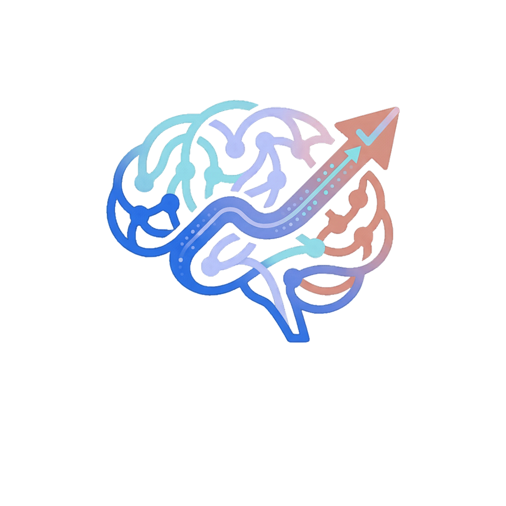
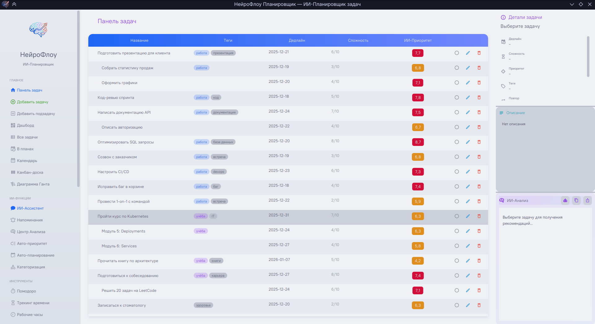
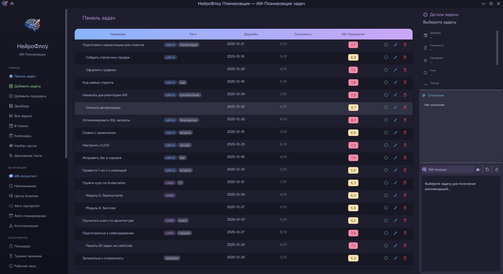

<p align="center">
  
</p>

# 🧠 НейроФлоу Планировщик

**Интеллектуальный планировщик задач с ИИ-функциями**


---

## 📋 О проекте

**НейроФлоу** — это современное десктопное приложение для управления задачами с интеграцией искусственного интеллекта. Приложение помогает эффективно планировать, приоритизировать и отслеживать выполнение задач.

### ✨ Основные возможности

- 📝 **Управление задачами** — создание, редактирование, удаление, подзадачи
- 🤖 **ИИ-анализ** — автоматический анализ задач через Ollama/OpenAI API
- 🎯 **Авто-приоритизация** — интеллектуальный расчёт приоритетов
- 🏷️ **Умная категоризация** — автоматическое определение категорий
- 📊 **Аналитика** — статистика, графики, тепловые карты
- 📅 **Календарь и Канбан** — различные представления задач
- 🎨 **Темы оформления** — светлая (Latte) и тёмная (Mocha) темы Catppuccin
- 📤 **Экспорт** — PDF, Excel, CSV, Markdown, DOCX
- ⏱️ **Трекинг времени** — учёт времени работы над задачами
- 🍅 **Помодоро** — встроенный таймер для фокусировки

---

## 🖼️ Скриншоты

<!-- Добавьте скриншоты приложения -->
| Светлая тема | Тёмная тема |
|--------------|-------------|
|  |  |

---

## 🛠️ Технологии

| Технология | Версия | Назначение |
|------------|--------|------------|
| Java | 21 | Основной язык |
| JavaFX | 21 | GUI фреймворк |
| SQLite | 3.x | База данных |
| Ikonli | 12.3.1 | Иконки MaterialDesign2 |
| iText | 7.2.5 | Экспорт в PDF |
| Apache POI | 5.2.5 | Экспорт в Excel |
| JUnit 5 | 5.10.1 | Тестирование |
| TestFX | 4.0.18 | UI-тестирование |

---

## 📦 Установка

### Требования

- Java 21 или выше
- Maven 3.8+ (для сборки)

### Сборка из исходников

```bash
# Клонирование репозитория
git clone https://github.com/leocallidus/neuroflow-planner.git
cd neuroflow-planner

# Сборка проекта
./mvnw clean package -DskipTests

# Запуск
java -jar target/NeuroFlow-Planner-1.0-SNAPSHOT.jar
```

### Запуск через Maven

```bash
./mvnw javafx:run
```

---

## ⚙️ Настройка ИИ

Приложение поддерживает интеграцию с локальными и облачными ИИ-сервисами.

### Ollama (локально)

1. Установите [Ollama](https://ollama.ai/)
2. Запустите модель: `ollama run llama3`
3. В настройках приложения укажите:
   - URL: `http://localhost:11434/api/chat`
   - Модель: `llama3`

### OpenAI-совместимые API

В настройках укажите:
- URL API
- API ключ
- Название модели

---

## 🧪 Тестирование

```bash
# Модульные тесты
./mvnw test

# Интеграционные тесты (требуется дисплей)
./mvnw test -Dtest=NeuroFlowAppIT

# Все тесты
./mvnw test failsafe:integration-test
```

### Результаты тестирования

| Тип | Тестов | Успешно |
|-----|--------|---------|
| Модульные | 100 | ✅ 100% |
| Интеграционные | 11 | ✅ 100% |
| Совместимости | 5 | ✅ 100% |

---

## 📁 Структура проекта

```
neuroflow-planner/
├── src/
│   ├── main/
│   │   ├── java/com/example/neuroflowplanner/
│   │   │   ├── db/           # Работа с БД
│   │   │   ├── model/        # Модели данных
│   │   │   ├── service/      # Бизнес-логика и ИИ
│   │   │   ├── ui/           # UI компоненты
│   │   │   ├── util/         # Утилиты
│   │   │   └── NeuroFlowApp.java
│   │   └── resources/
│   │       ├── styles/       # CSS темы
│   │       └── images/       # Изображения
│   └── test/                 # Тесты
├── pom.xml
└── README.md
```

---

## 🎨 Темы оформления

Приложение использует цветовую палитру [Catppuccin](https://github.com/catppuccin/catppuccin):

- **Latte** — светлая тема
- **Mocha** — тёмная тема

Переключение темы доступно в настройках или через кнопку в интерфейсе.

---

## 📊 Функциональные возможности

### Управление задачами
- Создание задач с названием, описанием, дедлайном
- Подзадачи и зависимости между задачами
- Теги и категории
- Повторяющиеся задачи
- Архивация выполненных задач

### ИИ-функции
- Анализ задачи с рекомендациями
- Автоматический расчёт приоритета
- Умная категоризация по ключевым словам
- ИИ-ассистент (чат)
- Анализ настроения

### Представления
- Список задач (TreeTableView)
- Канбан-доска
- Календарь
- Диаграмма Ганта
- Дашборд

### Аналитика
- Статистика выполнения
- Тепловая карта активности
- Прогноз загруженности
- Оценка времени

---

## 🔧 Конфигурация

Файл конфигурации: `~/neuroflow_data/config.properties`

```properties
# Тема оформления
dark.theme=false

# ИИ-сервер
api.url=http://localhost:11434/api/chat
api.model=llama3
api.key=

# Рабочие часы
work.hours.start=09:00
work.hours.end=18:00
```

## 🤝 Вклад в проект

1. Форкните репозиторий
2. Создайте ветку для фичи (`git checkout -b feature/amazing-feature`)
3. Зафиксируйте изменения (`git commit -m 'Add amazing feature'`)
4. Отправьте в ветку (`git push origin feature/amazing-feature`)
5. Откройте Pull Request

---

## 📝 Лицензия

Распространяется под лицензией MIT. См. файл `LICENSE` для подробностей.

---

## 👤 Автор

**leocallidus**

---

## 🙏 Благодарности

- [Catppuccin](https://github.com/catppuccin/catppuccin) — цветовая палитра
- [Ikonli](https://kordamp.org/ikonli/) — иконки
- [Ollama](https://ollama.ai/) — локальный ИИ
